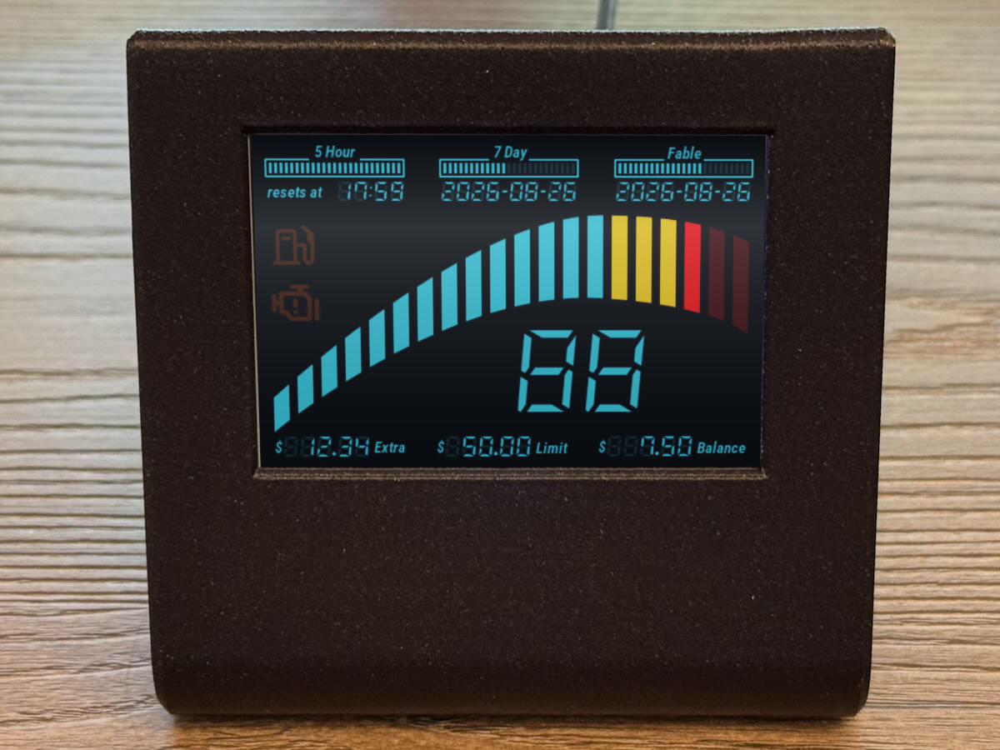

# Claude-o-meter



A Claude tachometer which shows your token use within your session
window. The 5-hour window is the main gauge, with its redline where
your tokens will be exhaused exactly at the end of the window. The
fuel gauge is your 7-day window.

This is a simple Python app designed to run on a Raspberry Pi, but it
can also display in a window on your desktop. You'll need to configure
your Anthropic session ID (see below). The tach shows a rough
window-average burn rate from the first poll; after ~10 minutes of
samples the slope switches to a more accurate recent regression.

I've included a 3D printable frame of my own design which fits the
Adafruit PiTFT 3.5 Plus. This works fine on the current Raspberry Pi
OS (trixie-based) as of 2026.

## Quick start (desktop)

```bash
python3 -m venv .venv
.venv/bin/pip install -r claude_o_meter/requirements.txt
.venv/bin/python -m claude_o_meter           # DATA_SOURCE defaults to "fake"
```

A 480×320 window opens. With the default `DATA_SOURCE = "fake"` the gauges run on
a demo cycle — no network or session key needed — so you can watch every state:
the tach and fuel gauge sweep their range, the low-fuel and check-engine lights
blink near each crest, and the fault message cycles through its variants. Close
the window or press Ctrl-C to quit.

To step through every state quickly instead of waiting out the cycle, run the
reveal demo — tach, fuel, both lights, then the fault messages:

```bash
.venv/bin/python -m claude_o_meter.demo_reveal       # optional ms/step, e.g. 300
```

## Live mode (your real usage)

Live mode polls your account, so it needs your `claude.ai` session cookie:

1. Open https://claude.ai signed in, then DevTools → Application → Cookies →
   `https://claude.ai`, and copy the `sessionKey` value (starts `sk-ant-sid01-...`).
2. Set `DATA_SOURCE = "live"` in `claude_o_meter/config.toml`.
3. Run with the cookie in the environment:

```bash
export CLAUDE_SESSION_KEY=sk-ant-sid01-...
.venv/bin/python -m claude_o_meter
```

A provisional burn rate is available immediately (utilization ÷ hours elapsed
in the window). After ~10 minutes of samples the gauge switches to the tighter
recent-regression estimate. The cookie lasts weeks to months; when it expires
the check-engine light shows a "needs auth" message — get a fresh `sessionKey`
and restart.

(`curl_cffi`, used only in live mode, mimics Chrome's TLS fingerprint to get past
Cloudflare on `claude.ai`.)

## Configuration (`claude_o_meter/config.toml`)

| Key | Default | Notes |
|-----|---------|-------|
| `DATA_SOURCE` | `"fake"` | `"fake"` (offline oscillating values) or `"live"` (real polling) |
| `POLL_SECONDS` | `60` | Poll cadence; in live mode it sets `POLL_INTERVAL_SECONDS` |
| `UTC_OFFSET_HOURS` | `0` | Integer offset for displayed clock/date (e.g. `-7` for PDT) |
| `DISPLAY_MODE` | `"window"` | `"window"` (SDL window on a desktop) or `"framebuffer"` (Pi TFT) |
| `FB_DEVICE` | `"/dev/fb1"` | Framebuffer device when `DISPLAY_MODE="framebuffer"` |
| `DIM_OPACITY` | `212` | Dimming-rectangle opacity 0–255 (212 ≈ 83% ghost) |

Any key above can also be set as an environment variable of the same name, which
overrides the TOML (the Pi service uses this to set `DISPLAY_MODE=framebuffer`
and `DATA_SOURCE=live`).

### Live-mode environment variables

The session key and a few overrides come from the environment, not the TOML file:

| Var | Required | Default | Notes |
|-----|----------|---------|-------|
| `CLAUDE_SESSION_KEY` | yes (live) | — | `claude.ai` `sessionKey` cookie value |
| `CLAUDE_ORG_ID` | no | auto-discover | Pin a specific org instead of discovering it |
| `POLL_INTERVAL_SECONDS` | no | from `POLL_SECONDS` | Poll cadence override |
| `DB_PATH` | no | `./samples.db` | SQLite history file for the 5h/7d windows |

## Raspberry Pi 3 + PiTFT deployment

The same program runs on a Raspberry Pi 3 driving a 3.5" PiTFT (480×320) panel
as a single `systemd` service. There is no desktop or X server — the renderer
writes frames straight to the panel's framebuffer (SDL `dummy` video driver).
Verified on 64-bit Raspberry Pi OS Lite (Trixie).

### 1. Enable the PiTFT panel (legacy framebuffer driver)

Install Adafruit's PiTFT support, then make sure the panel uses the **legacy
`fb_hx8357d` framebuffer driver — not the DRM variant.** In
`/boot/firmware/config.txt` the overlay line must **not** contain `,drm`:

```
dtoverlay=pitft35-resistive,rotate=90,speed=20000000,fps=20
```

The `,drm` flag (which the Adafruit installer may add) forces the DRM/KMS
driver, which leaves the SPI panel blank until a modeset and conflicts with
`vc4-kms-v3d` — symptom: a white/blank screen and no console. Remove it and
reboot:

```bash
sudo sed -i '/pitft35-resistive/ s/,drm,/,/' /boot/firmware/config.txt
sudo reboot
```

After reboot, confirm the framebuffer:

```bash
cat /sys/class/graphics/fb1/name            # -> fb_hx8357d
cat /sys/class/graphics/fb1/bits_per_pixel  # -> 16   (RGB565)
cat /sys/class/graphics/fb1/virtual_size    # -> 480,320
```

The renderer auto-detects the depth (16bpp RGB565 here, 32bpp as a fallback);
`numpy` packs each RGB565 frame.

### 2. Clone and install

```bash
git clone https://github.com/joshcarter/claude-o-meter.git ~/claude-o-meter
cd ~/claude-o-meter
python3 -m venv .venv
.venv/bin/pip install -r claude_o_meter/requirements.txt
```

`pygame`, `curl_cffi`, and `numpy` all install from prebuilt aarch64 wheels on
64-bit Raspberry Pi OS — no compiler required.

### 3. Session key

```bash
printf 'CLAUDE_SESSION_KEY=sk-ant-sid01-...\n' > ~/claude-o-meter/.env
chmod 600 ~/claude-o-meter/.env
```

### 4. Install the service

`deploy/claude-o-meter.service` assumes the repo at `/home/pi/claude-o-meter`,
runs as user `pi`, and sets `DISPLAY_MODE=framebuffer` / `DATA_SOURCE=live` via
the environment (so no `config.toml` edit is needed). The `pi` user must be in
the `video` group to write `/dev/fb1` (the default on Raspberry Pi OS). Edit the
unit if your path or user differs.

```bash
sudo cp ~/claude-o-meter/deploy/claude-o-meter.service /etc/systemd/system/
sudo systemctl daemon-reload
sudo systemctl enable --now claude-o-meter
systemctl status claude-o-meter --no-pager
```

`samples.db` is created under `/var/lib/claude-o-meter/` (systemd
`StateDirectory`). Reboot once to confirm the dashboard comes up unattended:

```bash
sudo reboot
```

Logs: `journalctl -u claude-o-meter -f`.

## The instrument cluster

What each part of the display shows:

| Widget | Source | Mapping |
|--------|--------|---------|
| Horizontal 20-seg **tachometer** (reveals left→right) | 5h `redline_ratio` | burn rate vs sustainable; non-linear (`tach_position`) |
| Two-digit **0–99** readout | same as tach | numeric form of the tach |
| Vertical 20-seg **fuel gauge** (drains top→bottom) | 7d `utilization` | remaining = clamp(100 − util, 0, 100); linear |
| **Low-fuel** light | 7d `utilization` | on when remaining ≤ 20% (util ≥ 80%) |
| **Check-engine** light + message | fault state | poller-unreachable / data-stale / needs-auth |
| **Extra use $**, **Extra limit $**, **Balance $** | `extra_usage` + `/prepaid/credits` | cents → USD, up to 999.99 |
| **7-day reset date** / **5-hour reset time** | window `resets_at` | `fmt_date` / `fmt_hhmm` |

## Tachometer scale (the "redline")

The gauge and the 0–99 readout both come from the 5-hour `redline_ratio`
reported by the poller (`burn_rate / sustainable_rate`, where `1.0` means you
are on track to spend the window's whole budget exactly when it resets). The
mapping lives in `claude_o_meter/gauges.py`.

`tach_position()` maps the ratio to a continuous gauge position
`0.0 .. TACH_FRAMES-1` (20 segments) in two pieces:

- **Below the redline** (`ratio` ≤ 1.0): a concave curve,
  `position = REDLINE_FRAME * ratio ** BLUE_EXPONENT`. With
  `BLUE_EXPONENT = 0.5` it is steep at low ratios and flattens toward the
  redline, so a modest user still sees the needle move through the day.
- **Above the redline** (`ratio` > 1.0): linear from `REDLINE_FRAME` to the top
  segment, pegging once the burn rate reaches `RED_FULL_RATIO` (default 2×
  sustainable).

`redline_ratio == 1.0` lands exactly on `REDLINE_FRAME` (17), the top of the
gauge's yellow band — anything past that is red. The readout is the same
position scaled to 0–99 (`tach_number()`) instead of quantised to segments, so
it moves even between segment changes.

| `redline_ratio` | segment | number | zone |
|---|---|---|---|
| 0.05 | 4  | 19 | blue |
| 0.20 | 8  | 38 | blue |
| 0.50 | 12 | 60 | blue |
| 0.80 | 15 | 75 | yellow |
| 1.00 | 17 | 84 | yellow (redline) |
| 1.60 | 19 | 93 | red |
| ≥2.00 | 20 | 99 | red |

Tuning knobs in `claude_o_meter/gauges.py`: `REDLINE_FRAME`, `BLUE_EXPONENT`
(lower = more sensitive at low use), and `RED_FULL_RATIO`.

## Tests

```bash
.venv/bin/pip install pytest
.venv/bin/python -m pytest claude_o_meter/tests/
```

The display tests run headless via `SDL_VIDEODRIVER=dummy` (set in the tests),
so no window or live cookie is needed.

## License

- **Code** — GPL-3.0, see [`LICENSE`](LICENSE).
- **3D-printed frame design** ([`printed_parts/`](printed_parts/)) — CC BY-SA 4.0,
  see [`printed_parts/LICENSE`](printed_parts/LICENSE). Also published on Printables.
